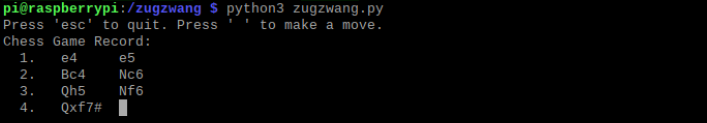

# zugzwang

A real-time machine learning-based Chess game recording system using Python3, OpenCV, and TensorFlow 2 deployed in a Raspberry Pi.\
*(For definition of "zugzwang" in terms of Chess, kindly visit https://en.wikipedia.org/wiki/Zugzwang)*

## Table of Contents

- [Demonstration (Scholar's Mate)](#demonstration-scholars-mate)
- [System Architecture Overview](#system-architecture-overview)
- [Hardware Setup](#hardware-setup)
- [Software Installations](#software-installations)
- [Official TensorFlow Docker Image](#official-tensorflow-docker-image)
- [TensorFlow Jupyter Notebook](#tensorflow-jupyter-notebook)
- [Machine Learning Model](#machine-learning-model)

---

## Demonstration (Scholar's Mate)

The following screenshots show the final position in a Scholar's Mate in a games of Chess.\
For more information on the Scholar's Mate, kindly visit: https://en.wikipedia.org/wiki/Scholar%27s_mate

- Scholar's Mate (Checkmate Position)

- Scholar's Mate Game Record (using Standard Algebraic Notation)

## System Architecture Overview

TODO

## Hardware Setup

| Devices | Information |
| ------ | ------ |
| Raspberry Pi 2 Model B | https://www.raspberrypi.org/products/raspberry-pi-2-model-b/ |
| Logicool C922n Web Camera | https://www.logicool.co.jp/ja-jp/product/c922n-pro-stream-webcam |
| Webcam Clamp Mount | https://www.amazon.co.jp/gp/product/B07H2TJWW4/ref=ppx_yo_dt_b_asin_title_o03_s00?ie=UTF8&psc=1 |
| Chess Board Game | https://www.amazon.co.jp/-/en/dp/B07S8ZLXQR/ref=lp_4108555051_1_5?srs=4108555051&ie=UTF8&qid=1596539909&sr=8-5 |

## Software Installations

- Raspberry Pi 2

| Library | Version | Install Command | Reference |
| ------ | ------ | ------ | ------ |
| OpenCV | 3.4.6 | pip3 install opencv-contrib-python==3.4.6.27 | https://github.com/EdjeElectronics/TensorFlow-Object-Detection-on-the-Raspberry-Pi/issues/67#issuecomment-557679983 |
| TensorFlow Lite | 2.1.0.post1 | pip3 install https://dl.google.com/coral/python/tflite_runtime-2.1.0.post1-cp37-cp37m-linux_armv7l.whl | https://www.tensorflow.org/lite/guide/python |
| python-chess | 0.31.3 | pip3 install python-chess | https://python-chess.readthedocs.io/en/latest/#installing |

- Microsoft Windows 10 Home

| Application | Install Instructions |
| ------ | ------ |
| Docker Toolbox | https://docs.docker.com/toolbox/toolbox_install_windows/ |
| VNC Viewer | https://www.realvnc.com/en/connect/download/viewer/ |

## Official TensorFlow Docker Image

- https://hub.docker.com/r/tensorflow/tensorflow/
- docker pull tensorflow/tensorflow:latest-jupyter
- docker run -it --rm -v /c/app:/tf/zugzwang -p 8888:8888 tensorflow/tensorflow:latest-jupyter
    - Example:

## TensorFlow Jupyter Notebook

- http://192.168.99.100:8888/tree
- To access the notebook for the first time, open link in a web browser with the following format:
http://192.168.99.100:8888/?token=replace_this_with_actual_token_value
    - For the example above, open this link in a web browser:\
    http://192.168.99.100:8888/?token=6757e503380afc7649c95c83b6dd6d1d0e7f25cada72e86b
    - Note:\
    The token will change on every start of the TensorFlow Docker container.

## Machine Learning Model

- Training
    - Uses a Convolutional Neural Network with TensorFlow 2 and Keras APIs.
    - Input = 50x50x3 RBG image
    - Output = 3-class softmax layer
- Inference
    - Uses TensorFlow Lite on Raspberry Pi 2 + Logicool C922n to classify each Chess board square into three categories:
        - A square with white piece
        - A square with no piece
        - A square with black piece

---

Copyright © 2020 Rennel Ongcoy (Eli). All rights reserved.